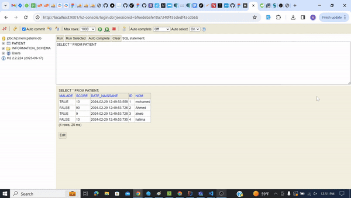

<h2>ORM, JPA Hibernate Spring Data</h2>

Ce projet Spring Boot est une application simple de gestion des patients.

<h3>Dépendances</h3>

Le projet utilise les dépendances suivantes :

<ul>
        <li>JPA</li>
        <li>H2 Database</li>
        <li>Spring Web</li>
        <li>Lombok</li>
</ul>

<h3>Résultats des tests</h3>

Voici les résultats des tests :

H2 Database :

Après la migration vers MySQL :

